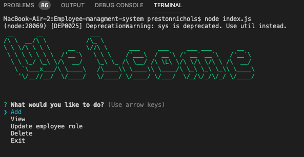

# Employee Tracker Mangement System

  ## License
  
  This application is licensed under the Unlicensed license.

  

  ## Description 
  * This application is designed to track add delete and date employees, roles, and departments for your buisness.

  ## Links:

  * Deployed application Url: N/A
  * Github Repo: https://github.com/xtreme6007/Employee-managment-system-psn.git
  
  ## Tabel of contents

> * [Title / Repository Name]
>   * [About](#about)
>   * [Table of contents](#tabel-of-contents)
>   * [Installation](#installation)
>   * [Usage](#usage)
>   * [Screenshots](#sceenshots)
>   * [Resources (Documentation and other links)](#resources)
>   * [Contributers](#contributers)
>   * [License](#license)
>   * [Tests](#tests)
>   * [Questions](#questions)

## Instalation

 To install this application clone the repository and npm install inside the folder install mysql and inquirer. 

## Usage

 In the Command Line Terimal

## Screen shots

https://drive.google.com/file/d/1oK4u41wFomfjZRMHlUPSAHMX-5zuRUO0/view

## Resources

## Contributers
Contributers for this project were:

Preston Nichols

## Tests

N/A

## Questions?
GitHub UserName: xtreme6007@yahoo.com
GitHub Profile: https://github.com/xtreme6007@yahoo.com
Email: prestonnichols96@gmail.com
Please contact me via email for any further question.

